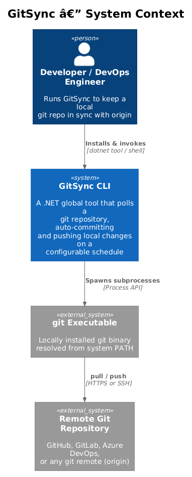
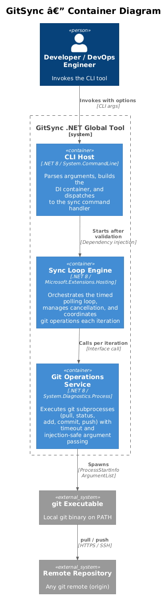
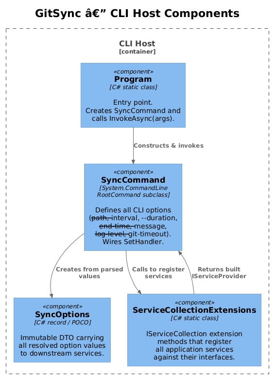
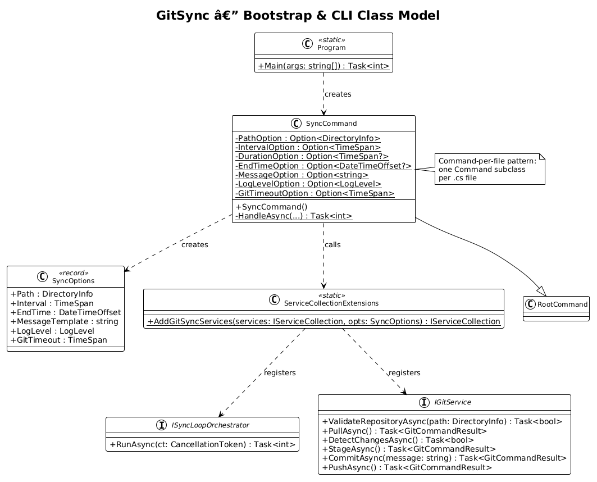
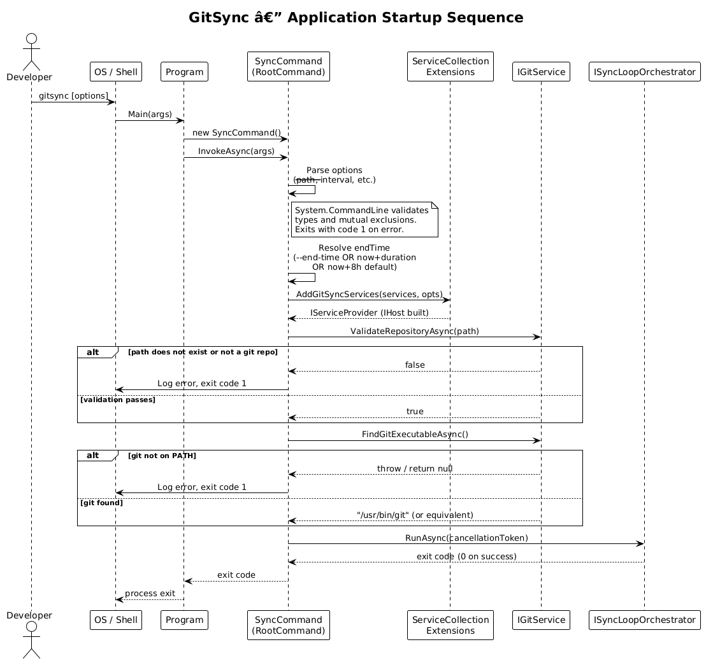

# Application Bootstrap & CLI Structure — Detailed Design

## 1. Overview

This document describes how the GitSync CLI tool is bootstrapped: how arguments are parsed, how the DI container is assembled, and how the tool is packaged as an installable .NET global tool published to NuGet.

**Actors:** Developer / DevOps engineer who installs the tool via `dotnet tool install -g GitSync` and runs it from any shell.

**Scope:** Entry point → argument parsing → DI composition → startup validation → hand-off to the sync loop. NuGet packaging metadata and the command-per-file pattern are also covered here.

**Key requirements:** L1-001 (CLI Tool Structure), L1-007 (Dependency Injection), L1-008 (NuGet Packaging) and their L2 children L2-001 through L2-003, L2-020 through L2-023.

---

## 2. Architecture

### 2.1 C4 Context Diagram


### 2.2 C4 Container Diagram


### 2.3 C4 Component Diagram


---

## 3. Component Details

### 3.1 Program

- **File:** `Program.cs`
- **Responsibility:** Minimal entry point. Constructs the `SyncCommand` (which is the `RootCommand`) and calls `InvokeAsync(args)`. Returns the exit code to the OS.
- **Interfaces:** `static Task<int> Main(string[] args)`
- **Dependencies:** `SyncCommand`

```csharp
// Program.cs
var command = new SyncCommand();
return await command.InvokeAsync(args);
```

There is intentionally no business logic here. The single responsibility is wiring the OS entry point to the System.CommandLine pipeline.

### 3.2 SyncCommand

- **File:** `Commands/SyncCommand.cs`
- **Responsibility:** Defines all CLI options as `static readonly Option<T>` fields, constructs the `RootCommand`, validates mutually exclusive options (`--end-time` vs `--duration`), and wires `SetHandler`. Inside the handler it builds the `IHost`, performs startup validation, and calls `ISyncLoopOrchestrator.RunAsync`.
- **Interfaces:** Extends `System.CommandLine.RootCommand`
- **Dependencies:** `ServiceCollectionExtensions`, `ISyncLoopOrchestrator`, `IGitService`

This is the **only** `Command` subclass in the project (command-per-file pattern, L2-002). If additional commands are needed in the future, each gets its own file.

**Options declared:**

| Option | Type | Default | Constraint |
|---|---|---|---|
| `--path` | `DirectoryInfo` | `Directory.GetCurrentDirectory()` | Must exist + be a git repo |
| `--interval` | `TimeSpan` | `00:00:01` | Min `00:00:00.100` |
| `--duration` | `TimeSpan?` | `null` | Positive, mutual-exclusive with `--end-time` |
| `--end-time` | `DateTimeOffset?` | `null` | ISO 8601, mutual-exclusive with `--duration` |
| `--message` | `string` | `"Auto-sync: {timestamp}"` | Non-empty after trim |
| `--log-level` | `LogLevel` | `Information` | One of the `LogLevel` enum values |
| `--git-timeout` | `TimeSpan` | `00:00:30` | Positive |

**Handler logic (pseudocode):**
```
1. Validate --end-time and --duration are not both set → exit 1 if so
2. Resolve endTime: --end-time ?? (startTime + --duration) ?? (startTime + 8h)
3. Build SyncOptions from resolved values
4. Build IHost via ServiceCollectionExtensions.AddGitSyncServices(...)
5. Resolve IGitService; call ValidateRepositoryAsync(path) → exit 1 if invalid
6. Resolve IGitService; call FindGitExecutableAsync() → exit 1 if not found
7. Resolve ISyncLoopOrchestrator; call RunAsync(ctx.GetCancellationToken())
8. Return exit code
```

### 3.3 SyncOptions

- **File:** `Models/SyncOptions.cs`
- **Responsibility:** Immutable data-transfer object carrying all resolved option values. Registered as a `Singleton` in DI so all services share the same instance.
- **Interfaces:** C# `record`
- **Dependencies:** None (pure POCO)

```csharp
public sealed record SyncOptions(
    DirectoryInfo Path,
    TimeSpan Interval,
    DateTimeOffset EndTime,
    string MessageTemplate,
    LogLevel LogLevel,
    TimeSpan GitTimeout);
```

### 3.4 ServiceCollectionExtensions

- **File:** `Infrastructure/ServiceCollectionExtensions.cs`
- **Responsibility:** Registers all application services with their correct lifetimes. Configures `Microsoft.Extensions.Logging` with the console provider and the configured log level.
- **Interfaces:** `static IServiceCollection AddGitSyncServices(this IServiceCollection, SyncOptions)`
- **Dependencies:** `IServiceCollection`

**Registrations:**

| Interface | Implementation | Lifetime |
|---|---|---|
| `SyncOptions` | (the instance) | `Singleton` |
| `IGitProcessRunner` | `GitProcessRunner` | `Singleton` |
| `IGitService` | `GitService` | `Singleton` |
| `ISyncLoopOrchestrator` | `SyncLoopOrchestrator` | `Singleton` |
| `ILogger<T>` | Console provider | (built-in) |

---

## 4. Data Model

### 4.1 Class Diagram


### 4.2 Entity Descriptions

**SyncOptions** — read-only snapshot of the CLI invocation. All services read from this singleton; nothing writes to it after construction. The `EndTime` is always an absolute `DateTimeOffset` by the time it reaches DI (the ambiguity between `--duration` and `--end-time` is resolved inside `SyncCommand.HandleAsync`).

---

## 5. Key Workflows

### 5.1 Application Startup



The sequence covers the happy path (validation passes, loop starts) and the two early-exit paths (bad working directory, git not on PATH). Both early-exit paths return exit code `1` so callers (CI systems, scripts) can detect failure.

---

## 6. Project Structure

```
GitSync/
├── GitSync.csproj                      ← PackAsTool, NuGet metadata
├── Program.cs                          ← Entry point only
├── Commands/
│   └── SyncCommand.cs                  ← RootCommand + all options + handler
├── Services/
│   ├── ISyncLoopOrchestrator.cs
│   ├── SyncLoopOrchestrator.cs
│   ├── IGitService.cs
│   ├── GitService.cs
│   ├── IGitProcessRunner.cs
│   └── GitProcessRunner.cs
├── Models/
│   ├── SyncOptions.cs
│   ├── GitCommandResult.cs
│   └── GitCommandOptions.cs
└── Infrastructure/
    └── ServiceCollectionExtensions.cs
```

### Command-Per-File Rule (L2-002)

Every `Command` subclass lives in its own `.cs` file under `Commands/`. Today there is one: `SyncCommand`. The pattern is enforced by convention; a linter rule (or code review checklist) should catch violations. Adding a new subcommand means: create `Commands/MyNewCommand.cs`, add `AddCommand(new MyNewCommand())` in `SyncCommand`, done — no other files change.

---

## 7. NuGet Packaging

Relevant `.csproj` properties (L2-022, L2-023):

```xml
<PropertyGroup>
  <OutputType>Exe</OutputType>
  <TargetFramework>net8.0</TargetFramework>
  <PackAsTool>true</PackAsTool>
  <ToolCommandName>gitsync</ToolCommandName>
  <PackageId>GitSync</PackageId>
  <Version>1.0.0</Version>
  <Description>A .NET global tool that auto-pulls, commits, and pushes a git repository on a configurable schedule.</Description>
  <Authors>YourName</Authors>
  <PackageTags>git;sync;automation;cli;dotnet-tool</PackageTags>
  <PackageLicenseExpression>MIT</PackageLicenseExpression>
  <RepositoryUrl>https://github.com/yourorg/GitSync</RepositoryUrl>
</PropertyGroup>
```

The `Version` is the single source of truth. It is not duplicated anywhere in code. `--version` is automatically provided by System.CommandLine and reads `Assembly.GetExecutingAssembly().GetName().Version`.

---

## 8. Security Considerations

- The `SyncCommand.HandleAsync` method receives `InvocationContext` from System.CommandLine, which exposes the `CancellationToken` tied to Ctrl+C. This token is threaded through all async calls so no orphaned processes remain after shutdown.
- `SyncOptions` is immutable (`record`); no service can mutate shared configuration state.

---

## 9. Open Questions

| # | Question | Owner |
|---|---|---|
| 1 | Should `--version` display the full semver including pre-release suffix, or just `MAJOR.MINOR.PATCH`? System.CommandLine reads from the assembly version, which may need `AssemblyInformationalVersion` for pre-release. | Implementer |
| 2 | Should there be a `--dry-run` flag (detect and log changes but skip commit/push)? Not in current requirements; worth considering before 1.0. | Product |
| 3 | Should the tool support a config file (e.g., `gitsync.json`) as an alternative to CLI options, for use in CI pipelines where long argument lists are awkward? | Product |
