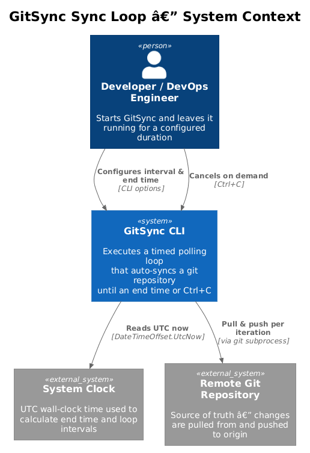
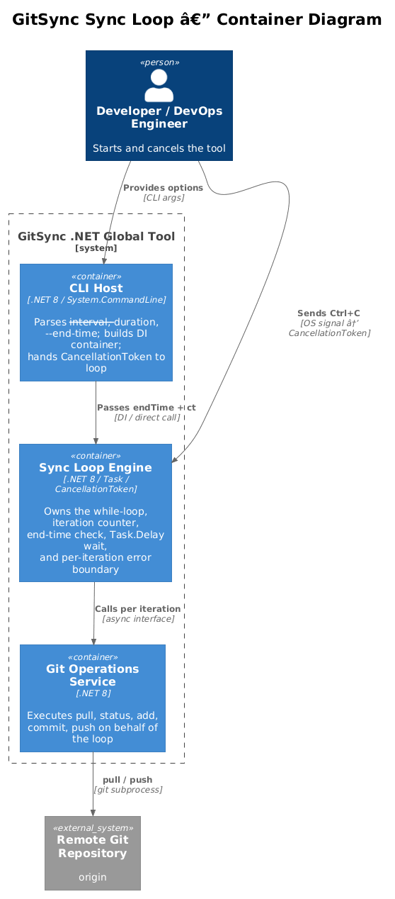
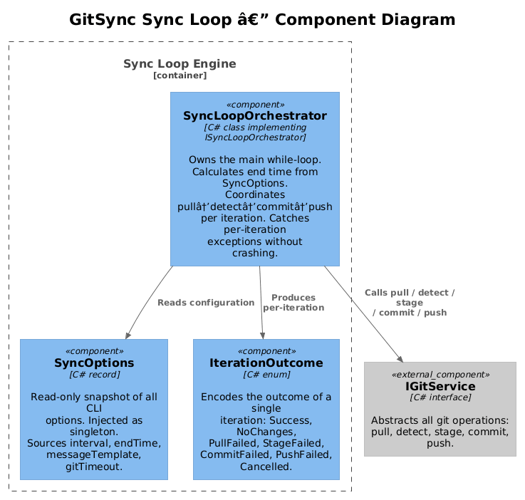
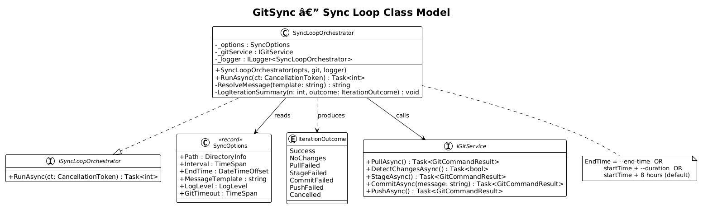
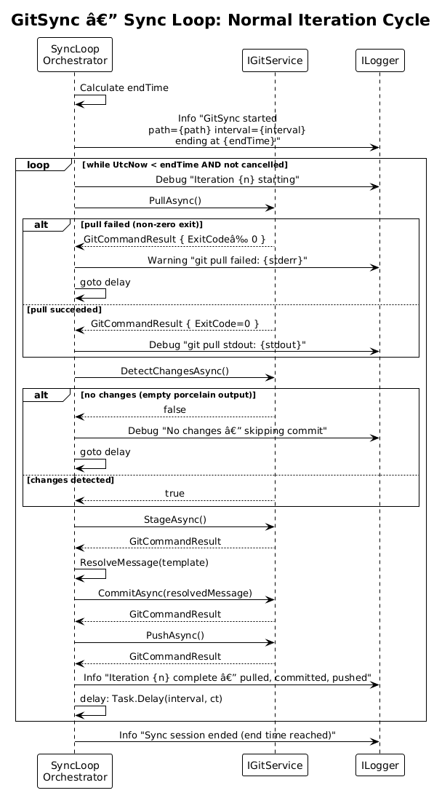
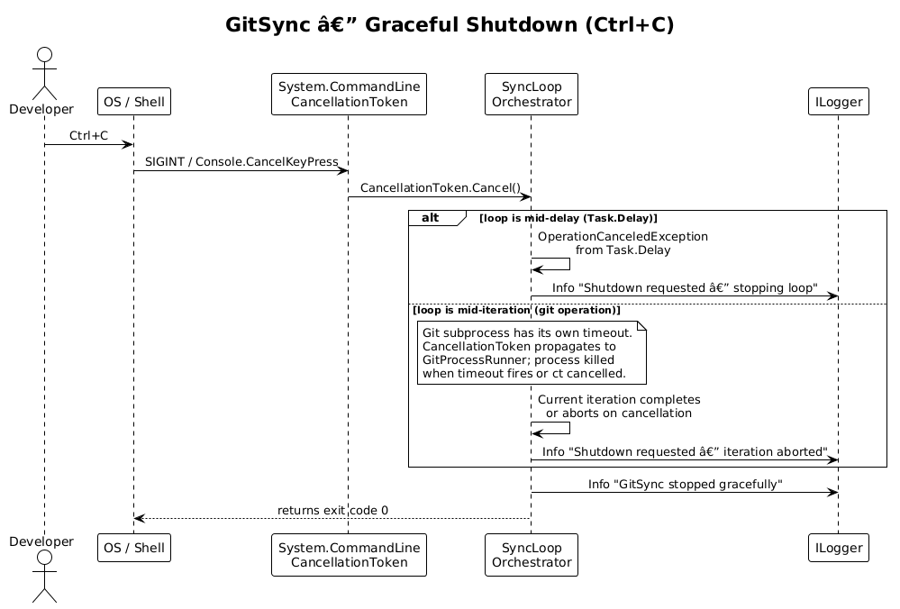

# Sync Loop Engine — Detailed Design

## 1. Overview

This document describes the sync loop engine: the component responsible for orchestrating the timed polling loop that drives all git operations. It controls iteration timing, end-condition checking, per-iteration error isolation, and graceful cancellation.

**Actors:** The sync loop runs unattended after the developer starts it. The developer interacts only to stop it (Ctrl+C) or wait for it to self-terminate at the configured end time.

**Scope:** Loop lifecycle from first iteration through end-condition (end time reached or Ctrl+C), including timing mechanics, error boundaries, and commit message template resolution.

**Key requirements:** L1-002 (Sync Loop Execution), L1-005 (Configuration), L1-006 (Observability), L1-009 (Resilience) and their L2 children L2-004 through L2-008, L2-015, L2-018, L2-019, L2-024, L2-025.

---

## 2. Architecture

### 2.1 C4 Context Diagram


### 2.2 C4 Container Diagram


### 2.3 C4 Component Diagram


---

## 3. Component Details

### 3.1 ISyncLoopOrchestrator

- **File:** `Services/ISyncLoopOrchestrator.cs`
- **Responsibility:** Abstraction for the sync loop. Enables testing without running a real git repository.

```csharp
public interface ISyncLoopOrchestrator
{
    Task<int> RunAsync(CancellationToken cancellationToken);
}
```

### 3.2 SyncLoopOrchestrator

- **File:** `Services/SyncLoopOrchestrator.cs`
- **Responsibility:** Owns the main `while` loop. Computes the loop end time, executes each iteration by calling `IGitService`, handles per-iteration errors, resolves commit message templates, and waits between iterations using a cancellation-aware delay.
- **Dependencies:** `SyncOptions` (singleton), `IGitService` (singleton), `ILogger<SyncLoopOrchestrator>`

**End-time resolution** (performed once at `RunAsync` start):

```
endTime = options.EndTime   (already resolved to an absolute DateTimeOffset by SyncCommand)
```

`SyncOptions.EndTime` is always an absolute `DateTimeOffset` by the time it reaches this class. The ambiguity between `--duration` and `--end-time` and the 8-hour default are resolved entirely inside `SyncCommand.HandleAsync` (see Feature 01 design).

**Main loop structure:**

```
iterationCount = 0
Log Info: startup banner (path, interval, endTime, logLevel)

while DateTimeOffset.UtcNow < endTime AND not ct.IsCancellationRequested:
    iterationCount++
    try:
        outcome = await ExecuteIterationAsync(iterationCount, ct)
        Log Info/Debug depending on outcome
    catch OperationCanceledException:
        Log Info: "Shutdown requested"
        break
    catch Exception ex:
        Log Error: ex (full details, L2-025)
        // loop continues — exception does NOT propagate

    try:
        await Task.Delay(options.Interval, ct)   // cancellation-aware wait
    catch OperationCanceledException:
        break

Log Info: "GitSync session ended — {iterationCount} iterations completed"
return 0
```

**Design trade-off — interval semantics:** The interval is applied *after* each iteration completes (not a fixed-rate timer). This means the actual period is `(iteration duration) + interval`. A fixed-rate approach would be more precise but risks overlapping iterations if git operations take longer than the interval. The chosen approach is simpler and safer for the auto-commit use case.

### 3.3 IterationOutcome

- **File:** `Models/IterationOutcome.cs`
- **Responsibility:** Discriminated enum that describes what happened in an iteration. Used only for logging; the loop does not branch on it after the fact.

```csharp
public enum IterationOutcome
{
    Success,      // pulled + committed + pushed
    NoChanges,    // pulled, no local changes
    PullFailed,   // git pull returned non-zero
    StageFailed,  // git add -A returned non-zero
    CommitFailed, // git commit returned non-zero
    PushFailed,   // git push returned non-zero
    Cancelled     // CancellationToken fired during iteration
}
```

### 3.4 Commit Message Template Resolution

Performed inside `SyncLoopOrchestrator.ResolveMessage(string template)`:

1. If `template` is null or whitespace after trim → substitute default `"Auto-sync: {timestamp}"` and log a warning.
2. Replace `{timestamp}` with `DateTimeOffset.UtcNow.ToString("yyyy-MM-ddTHH:mm:ssZ")`.
3. Return the resolved message. The result is a plain string passed directly to `IGitService.CommitAsync`; no further shell processing occurs (injection safety is enforced in `GitProcessRunner`, see Feature 03).

---

## 4. Data Model

### 4.1 Class Diagram


### 4.2 Entity Descriptions

**SyncLoopOrchestrator** — stateful only in `iterationCount` (a local variable, not a field) and the loop's `endTime` (computed once at startup). All other state lives in injected singletons. This makes the class straightforward to test: provide mock `IGitService` and `SyncOptions`, assert on logged output and return value.

**IterationOutcome** — not persisted or exposed externally. Used solely to drive the log message format for each iteration summary.

---

## 5. Key Workflows

### 5.1 Normal Loop Iteration



Each iteration follows a strict pipeline: **pull → detect → (skip if clean) → stage → commit → push**. Any step that fails short-circuits the remainder of *that iteration* but does not stop the loop. The next iteration starts fresh after the configured delay.

**Early-exit conditions within an iteration:**

| Step | Condition | Action |
|---|---|---|
| Pull | `ExitCode != 0` | Log Warning, skip remaining steps, wait for next iteration |
| Detect | No changes | Log Debug, skip stage/commit/push, wait for next iteration |
| Stage | `ExitCode != 0` | Log Error, skip commit/push, wait for next iteration |
| Commit | `ExitCode != 0` | Log Warning, skip push, wait for next iteration |
| Push | `ExitCode != 0` | Log Error, mark as PushFailed, wait for next iteration |

### 5.2 Graceful Shutdown (Ctrl+C)



System.CommandLine automatically hooks `Console.CancelKeyPress` and signals the `CancellationToken` passed to `SetHandler`. This token is threaded into `RunAsync` and into `Task.Delay`. When Ctrl+C is pressed:

- **If mid-delay:** `Task.Delay` throws `OperationCanceledException`, which the loop catches and breaks cleanly.
- **If mid-iteration (git op running):** The cancellation token is also passed to `IGitProcessRunner.RunAsync`. The git process will either complete normally (if already finishing) or be killed when the command timeout fires. Either way, the iteration ends and the loop exits.

The exit code is always `0` for a graceful shutdown. A non-zero exit code indicates a startup failure (invalid path, git not found).

---

## 6. Timing and Performance

- **CPU usage:** `Task.Delay` puts the thread into a timer-based wait, consuming no CPU between iterations.
- **Minimum interval:** 100 ms (enforced at parse time, L2-005). This prevents accidental tight-loop scenarios.
- **Clock drift:** The loop uses wall-clock comparison (`DateTimeOffset.UtcNow < endTime`) rather than counting iterations. If a long git operation causes an iteration to overrun the end time, the loop exits cleanly after that iteration rather than immediately killing it mid-way.
- **No catch-up:** Missed iterations (due to long git operations) are simply skipped. The tool does not attempt to "catch up" by running consecutive iterations without delay.

---

## 7. Security Considerations

- The `CancellationToken` from System.CommandLine is always passed to `Task.Delay` and to `IGitProcessRunner.RunAsync`. This prevents the scenario where Ctrl+C leaves a running git process uncleaned (L2-008).
- `SyncLoopOrchestrator` never directly accesses the file system or spawns processes — all such operations are delegated to `IGitService`. This limits the blast radius of any per-iteration exception.

---

## 8. Open Questions

| # | Question | Owner |
|---|---|---|
| 1 | Should the loop emit a heartbeat log at `Debug` level every N iterations even when there are no changes, to confirm it is alive? Useful for long-running deployments. | Product |
| 2 | Should the tool have a `--max-errors N` option that terminates the loop after N consecutive failed iterations, rather than running indefinitely? | Product |
| 3 | Should `IterationOutcome` be tracked in a running counter and included in the final summary log? (e.g., "12 successful, 3 no-change, 1 push-failed") | Implementer |
