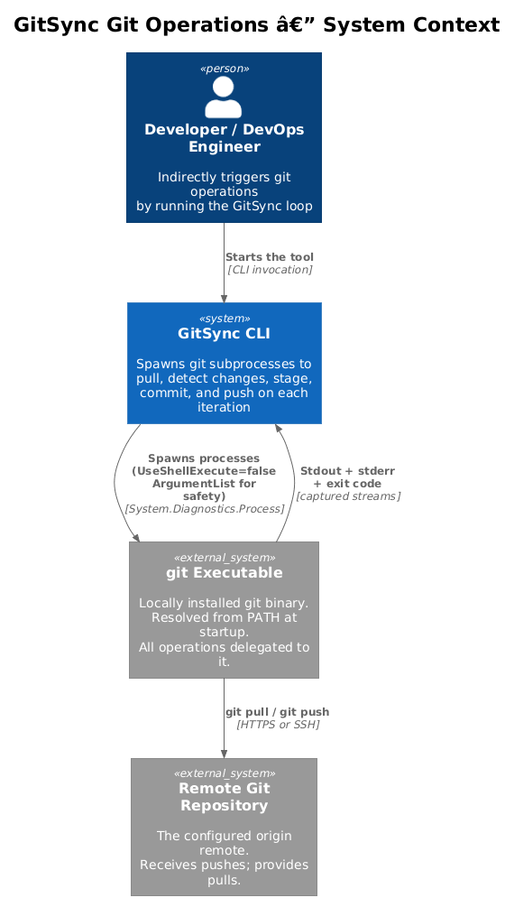
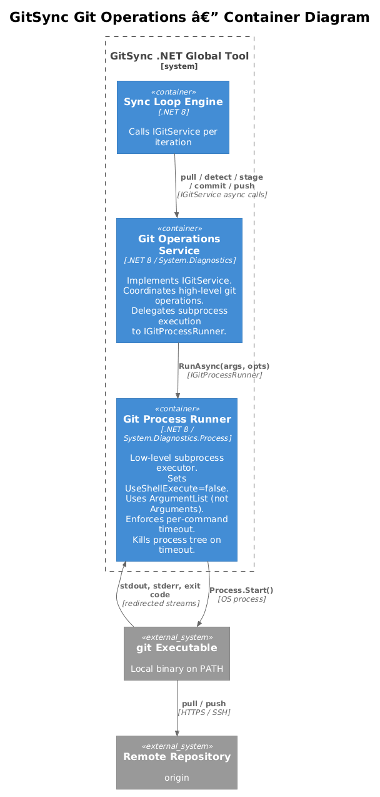
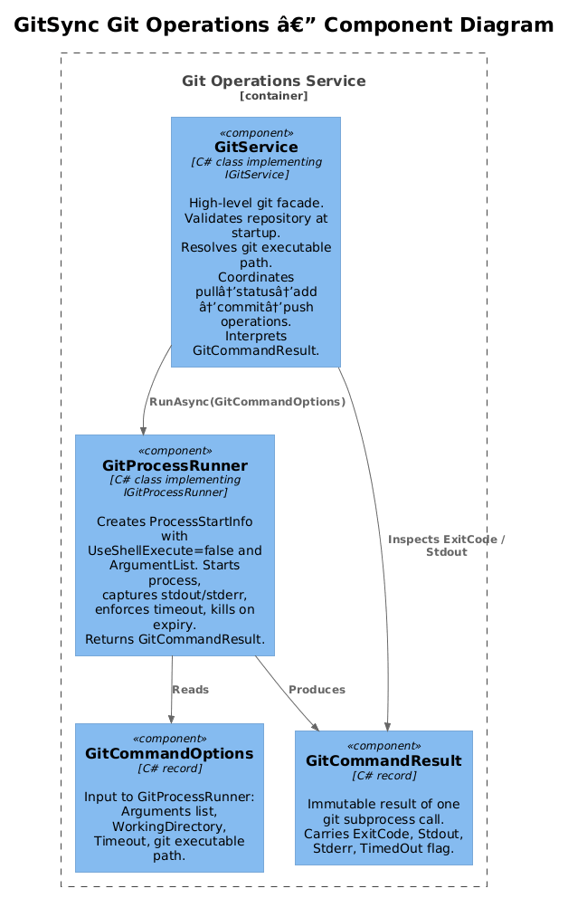
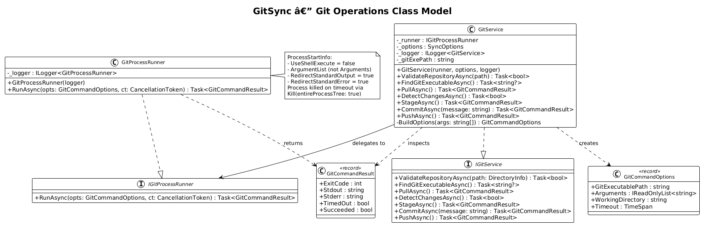
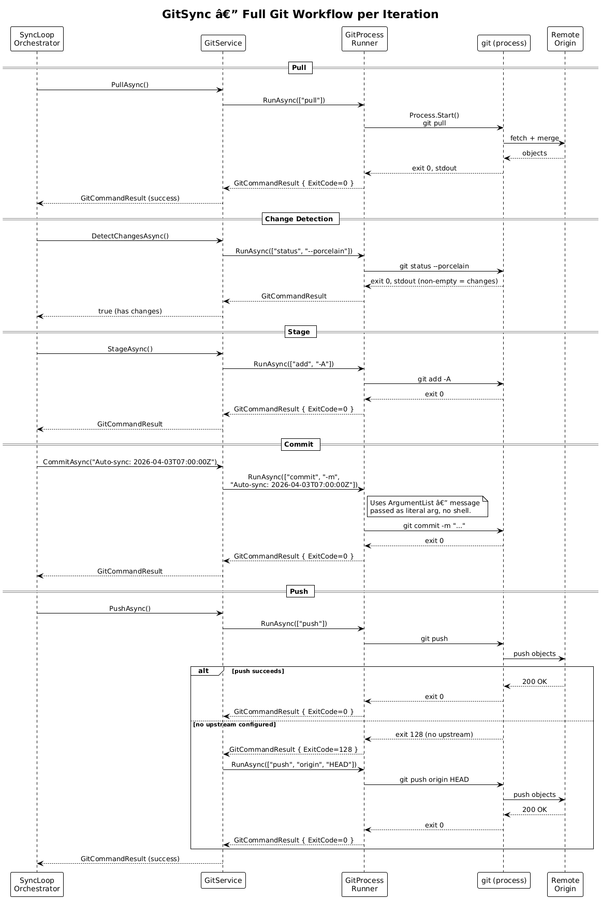
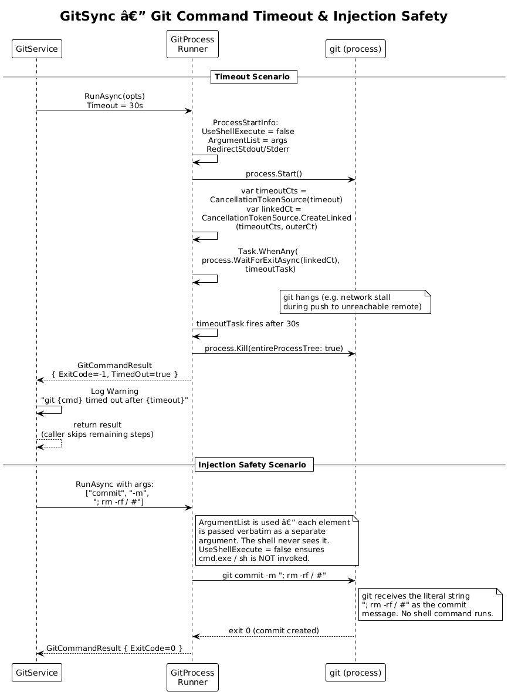

# Git Operations Service — Detailed Design

## 1. Overview

This document describes the Git Operations Service: the layer responsible for executing all `git` subprocesses safely, capturing their output, enforcing timeouts, and presenting a clean async interface to the sync loop. It also covers shell-injection prevention and git executable discovery.

**Actors:** The sync loop calls `IGitService` per iteration; the developer is indirectly served by each successful pull/commit/push.

**Scope:** Everything from "resolve the git binary on PATH" through "push to origin", including process lifecycle management, timeout enforcement, stdout/stderr capture, and argument injection safety.

**Key requirements:** L1-003 (Git Pull), L1-004 (Change Detection & Auto-Commit), L1-009 (Resilience & Safety) and their L2 children L2-009 through L2-015, L2-024, L2-026, L2-027.

---

## 2. Architecture

### 2.1 C4 Context Diagram


### 2.2 C4 Container Diagram


### 2.3 C4 Component Diagram


---

## 3. Component Details

### 3.1 IGitService

- **File:** `Services/IGitService.cs`
- **Responsibility:** Defines the contract for all high-level git operations. Decouples the sync loop from process execution details and from the git executable itself.

```csharp
public interface IGitService
{
    Task<bool>            ValidateRepositoryAsync(DirectoryInfo path);
    Task<string?>         FindGitExecutableAsync();
    Task<GitCommandResult> PullAsync();
    Task<bool>            DetectChangesAsync();
    Task<GitCommandResult> StageAsync();
    Task<GitCommandResult> CommitAsync(string message);
    Task<GitCommandResult> PushAsync();
}
```

### 3.2 GitService

- **File:** `Services/GitService.cs`
- **Responsibility:** Implements `IGitService`. Holds the resolved git executable path (set once via `FindGitExecutableAsync`). Constructs `GitCommandOptions` for each operation and delegates subprocess execution to `IGitProcessRunner`. Interprets `GitCommandResult` to implement higher-level logic (e.g., the push-retry with `origin HEAD` when the first push fails with exit code 128).
- **Dependencies:** `IGitProcessRunner`, `SyncOptions`, `ILogger<GitService>`

**Git executable resolution** (`FindGitExecutableAsync`):

The method iterates the entries in the `PATH` environment variable and checks for `git` (or `git.exe` on Windows) using `File.Exists`. It caches the result in a private field. If not found, it returns `null`; the caller (`SyncCommand.HandleAsync`) logs the error and exits with code 1.

**`ValidateRepositoryAsync`** (L2-026):

1. Check `path.Exists` → if false, return false.
2. Run `git rev-parse --is-inside-work-tree` in the path.
3. If exit code is 0 and stdout contains `true` → return true.
4. Otherwise return false.

This is more robust than checking for a `.git` directory because it handles git worktrees correctly.

**`PushAsync` retry logic** (L2-014):

```
result = await runner.RunAsync(["push"], opts)
if result.ExitCode != 0 AND result.Stderr contains "no upstream":
    Log Debug "Retrying with explicit origin HEAD"
    result = await runner.RunAsync(["push", "origin", "HEAD"], opts)
return result
```

### 3.3 IGitProcessRunner

- **File:** `Services/IGitProcessRunner.cs`
- **Responsibility:** Low-level subprocess abstraction. Accepts `GitCommandOptions` and returns `GitCommandResult`. Testable independently of the file system or installed git.

```csharp
public interface IGitProcessRunner
{
    Task<GitCommandResult> RunAsync(
        GitCommandOptions options,
        CancellationToken cancellationToken = default);
}
```

### 3.4 GitProcessRunner

- **File:** `Services/GitProcessRunner.cs`
- **Responsibility:** The only place in the codebase that calls `System.Diagnostics.Process`. Sets `UseShellExecute = false` and uses `ArgumentList` (never the `Arguments` string) to prevent shell injection. Captures stdout and stderr as strings. Enforces per-command timeout.
- **Dependencies:** `ILogger<GitProcessRunner>`

**ProcessStartInfo setup** (L2-027):

```csharp
var psi = new ProcessStartInfo
{
    FileName               = options.GitExecutablePath,
    WorkingDirectory       = options.WorkingDirectory,
    UseShellExecute        = false,   // NEVER true
    RedirectStandardOutput = true,
    RedirectStandardError  = true,
    CreateNoWindow         = true,
};
foreach (var arg in options.Arguments)
    psi.ArgumentList.Add(arg);       // NOT psi.Arguments = "..."
```

**Timeout enforcement** (L2-024):

```csharp
using var timeoutCts = new CancellationTokenSource(options.Timeout);
using var linkedCts  = CancellationTokenSource.CreateLinkedTokenSource(
                           timeoutCts.Token, cancellationToken);

var stdoutTask = process.StandardOutput.ReadToEndAsync();
var stderrTask = process.StandardError.ReadToEndAsync();

try
{
    await process.WaitForExitAsync(linkedCts.Token);
}
catch (OperationCanceledException)
{
    process.Kill(entireProcessTree: true);
    return new GitCommandResult(-1, "", "Process killed", TimedOut: timeoutCts.IsCancellationRequested);
}

var stdout = await stdoutTask;
var stderr = await stderrTask;
return new GitCommandResult(process.ExitCode, stdout, stderr, TimedOut: false);
```

`Kill(entireProcessTree: true)` ensures child processes spawned by git (e.g., credential helpers) are also terminated.

---

## 4. Data Model

### 4.1 Class Diagram


### 4.2 Entity Descriptions

**GitCommandResult** — immutable record returned by every subprocess call. The `Succeeded` computed property is `ExitCode == 0 && !TimedOut`. Callers should always check `Succeeded` rather than `ExitCode == 0` directly to also handle timeout cases.

```csharp
public sealed record GitCommandResult(
    int    ExitCode,
    string Stdout,
    string Stderr,
    bool   TimedOut)
{
    public bool Succeeded => ExitCode == 0 && !TimedOut;
}
```

**GitCommandOptions** — immutable input to `GitProcessRunner`. All fields required; no optional fields to avoid accidental misuse.

```csharp
public sealed record GitCommandOptions(
    string                   GitExecutablePath,
    IReadOnlyList<string>    Arguments,
    string                   WorkingDirectory,
    TimeSpan                 Timeout);
```

**Design trade-off — separate `GitCommandOptions` vs. inline parameters:** A dedicated options record is used instead of individual method parameters so that the interface is stable as new options are added (e.g., environment variables, stdin input) without breaking every call site.

---

## 5. Key Workflows

### 5.1 Full Git Workflow (Pull → Detect → Stage → Commit → Push)



The diagram shows the happy path. `GitService` makes five sequential calls to `GitProcessRunner`. Each call produces a `GitCommandResult`. `GitService` checks `result.Succeeded` after each step and returns the result to `SyncLoopOrchestrator`, which decides how to proceed (see Feature 02 design for the branching logic).

**`git status --porcelain` interpretation:**

`DetectChangesAsync` runs `git status --porcelain` and returns `stdout.Trim().Length > 0`. The `--porcelain` flag produces machine-readable output: one line per changed file, prefixed with two status characters. An empty output means a clean working tree (L2-011).

### 5.2 Git Command Timeout & Injection Safety



The timeout scenario shows `GitProcessRunner` killing the git process tree after the configured timeout fires. The injection safety scenario shows why `ArgumentList` is critical: the shell-sensitive characters in the commit message are passed as a literal argument, never interpreted by a shell.

---

## 6. API Contracts

`IGitService` is the boundary between the loop and git. All methods return `Task<>` and accept no `CancellationToken` directly — the cancellation token is held by `GitProcessRunner` internally (via the `SyncOptions.GitTimeout` and the outer CancellationToken passed through `GitService`'s constructor or a stored field).

**Alternative considered:** Passing `CancellationToken` to each `IGitService` method directly. This was rejected because `GitService` is a singleton and the token changes per invocation context. Instead, `SyncLoopOrchestrator` passes the token when constructing the `GitCommandOptions` through the `GitService.BuildOptions` helper.

> **Note for implementers:** `GitService` must store the outer `CancellationToken` from the loop's `RunAsync` call. One clean approach: expose a `SetCancellationToken(CancellationToken)` method called by `SyncLoopOrchestrator` before each iteration, or (preferred) pass the token through each `IGitService` method signature. The interface above should be updated to include `CancellationToken ct = default` on each method if the latter approach is chosen.

---

## 7. Security Considerations

### Shell Injection Prevention (L2-027)

The single most important security property of `GitProcessRunner`:

- `UseShellExecute = false` — the OS executes `git` directly; no `cmd.exe` or `/bin/sh` intermediary.
- `psi.ArgumentList.Add(arg)` — each argument is passed as a separate, verbatim entry in the argument vector. The OS passes it directly to git's `argv`. No quoting, no escaping, no shell expansion.
- The `Arguments` string property of `ProcessStartInfo` is **never set**. Setting it while `UseShellExecute = false` still bypasses shell *execution* but requires manual quoting, which is error-prone.

**Threat model:** A developer could pass `--message "; rm -rf /"` to the CLI. With `ArgumentList`, git receives this as a literal 13-character commit message. Without this protection (i.e., using shell execution), the `;` would terminate the git command and the `rm -rf /` would execute.

### Working Directory Validation (L2-026)

`GitService.ValidateRepositoryAsync` is called before the loop starts. This prevents the tool from attempting git operations on a directory that is not a repository — which would cause `git` to exit with error 128 on every iteration, polluting logs without providing useful output.

---

## 8. Open Questions

| # | Question | Owner |
|---|---|---|
| 1 | Should `GitService` support SSH agent forwarding or credential helper configuration, or is it assumed the local git credential store is pre-configured by the developer? Currently, git credential handling is entirely transparent — the spawned git process inherits the parent's environment. | Product |
| 2 | Should `DetectChangesAsync` exclude certain file patterns (e.g., `.DS_Store`, `Thumbs.db`)? This would require a configurable ignore list or reliance on `.gitignore`. Currently the tool commits whatever git considers changed. | Product |
| 3 | `PushAsync` retries once with `origin HEAD` on upstream-missing error. Should there be a configurable remote name (default: `origin`) instead of hard-coding the string? | Implementer |
| 4 | On Windows, `git.exe` may be found in multiple locations (Git for Windows, WSL, Scoop, Chocolatey). Should the tool prefer a specific installation, or use the first one found on PATH? | Implementer |
